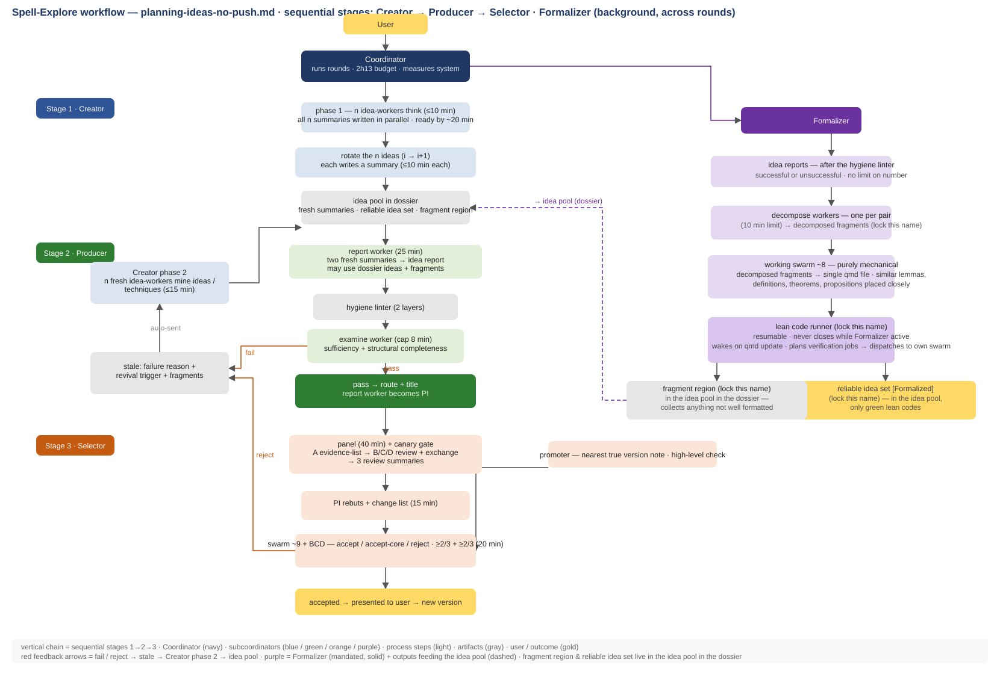
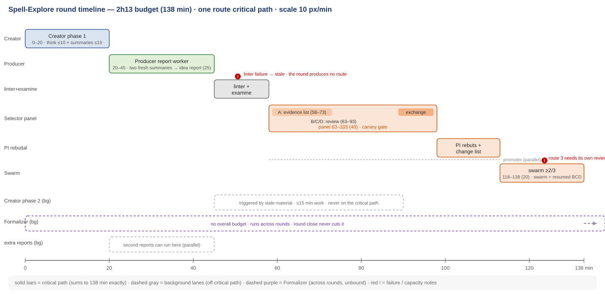
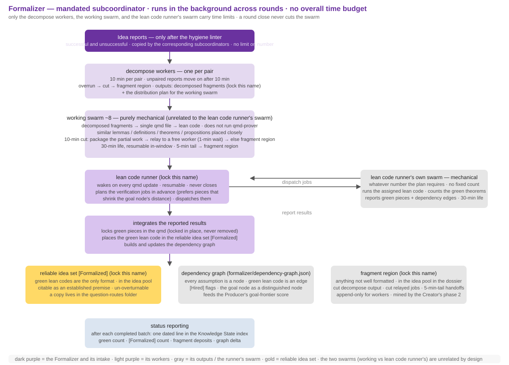
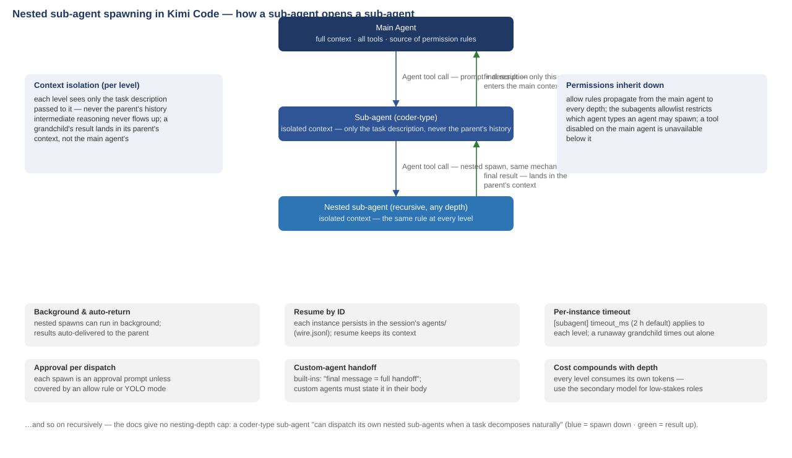

# Spell-Explore

Adversarial multi-agent proof exploration protocol. A rough idea goes in; attacked, reviewed, and Lean-verified mathematics comes out. The output is a manuscript at a milestone — nothing is a certificate.

## What it is

Spell-Explore runs a project of background agents against a locked goal, in fixed 133-minute rounds:

- **Coordinator** — the top agent. Runs each round, enforces the timeline, regulates the four subcoordinators, measures the system (idea-yield, premature kills — never the votes), maintains `question-routes/`, and writes the manuscript (PDF) when the project reaches a milestone.
- **Creator** — idea generation. Each phase runs n idea-workers (0 ≤ n ≤ 8); the n ideas are rotated (idea of worker i goes to worker i+1, wrapping around) and each worker writes a fresh summary into the idea pool. Phase 1 thinks around the locked goal with maximal freedom — wild ideas are preserved, not pruned: every summary is archived in the append-only idea pool and can be revived later, a revival trigger ("re-examine when <event>") returning a stalled idea or fragment to the pairing queue. Phase 2 mines stale material, the reliable idea set, and the fragment region.
- **Producer** — pairing and report production. Pairs fresh summaries by complementarity and a goal-frontier score: term overlap with the goal, the `[Formalized]`/`[Hired]` premises an idea can cite on the dependency-tree path toward the goal, whether the idea would hire new assumptions, and provenance. The report worker writes an idea report (25 min); the hygiene linter (two layers) and the examine worker (sufficiency + structural completeness) gate it; a successful report becomes a route with a title, and its writer becomes the PI.
- **Selector** — adversarial review. A panel (workerA evidence list, B/C/D review, three review summaries) plus a canary gate (seeded known-false claim + planted step-error, excluded from the record) reviews each route; the PI rebuts and makes a change list (15 min) while a promoter writes the nearest-true-version note — a high-level check on the route's claims. The decision swarm (~9) and the resumed BCD reviewers judge the route itself and vote **accept / accept-core / reject**: accept needs ≥2/3 of both; accept-core banks the route's salvageable core, grounded in the route's material, as a reduced route with its own title. Every rejecting vote names the load-bearing obstruction.
- **Formalizer** — Lean formalization. Lint-passed reports are decomposed into fragments; the working swarm (~8, unrelated to the lean code runner's swarm) transforms them into a single qmd file and lean code; the **lean code runner** plans the verification jobs in advance and dispatches them to its own swarm (whatever number the plan requires). Green pieces are locked in the qmd, their lean code enters the reliable idea set with the `[Formalized]` marker, and the dependency graph tracks assumption nodes, green edges, `[Hired]` flags, and the goal node.

## How it works

- Rounds are 133 minutes with binding per-phase windows; a phase that overruns is cut, and the round closes atomically with a decision list (abstracts of accepted routes; recycle / park for each unaccepted route; user nominations for next-round pairings).
- Every subagent runs in the background; the subcoordinators, the PIs, and the lean code runner never close.
- Everything is versioned (the goal file excepted — it is locked); the dossier — Knowledge State index, attempts log, verification ledger, idea pool — is the project's memory.
- The idea pool is append-only for workers: wild and speculative ideas are archived, never deleted — ideas that go nowhere are recorded as search fuel, and they can be revived: a revival trigger ("re-examine when <event>") jumps a stalled idea's fragment to the front of the pairing queue. nothing the project knows lives only in a previous context.
- The persistence and verification protocols bind the workers: no agent grades its own homework; a claim is established only after independent review; a `[Formalized]` idea is an additional premise channel that cannot be overturned by a later round.
- The project reaches a milestone only on full consensus (9/9 swarm + 3/3 BCD) with the accepted routes achieving the locked goal — operationally, the goal node of the dependency graph reachable from `[Formalized]`/`[Hired]` assumptions. Two consecutive rounds of total rejection (0/9, 0/3) trigger the Coordinator's steering report: split the goal, nominate pairings, or pause.

## Diagrams

The full pipeline: sequential stages Creator → Producer → Selector, the feedback lanes (fail/reject → stale → Creator phase 2 → idea pool), and the Formalizer running in the background across rounds.

The binding per-phase windows of one route's critical path.

The Lean formalization pipeline: lint-passed reports → decompose → working swarm → lean code runner (plans and dispatches to its own swarm) → reliable idea set, dependency graph, fragment region.

How agents spawn agents — context isolation, permissions, background execution, and resumability.

## Repository layout

- `skills/spell-explore/` — the built protocol as a runnable skill:
  - `SKILL.md` — entry point and roles overview;
  - `references/construction-plan.md` — the build plan;
  - `references/protocol/rules/` — operating rules for the core loop and each subcoordinator;
  - `references/protocol/.kimi-code/agents/` — agent profiles (tools, model preference, subagent allowlists);
  - `references/protocol/templates/` — artifact templates (fresh summary, idea report, route, review summaries, round close, stale entry, …);
  - `references/protocol/dossier/` — Knowledge State index and split-file templates;
  - `references/protocol/config.toml` — timeouts matching the 133-minute timeline.
- `construction-plan.md` — the top-level build plan.
- `*.svg` — diagrams of the round timeline, workflow, and subagent nesting.

The locked spec (`planning-idea.md`) is maintained separately and is not part of this repository.

## Running it

Install the skill from `skills/spell-explore` (e.g. into `~/.kimi-code/skills/spell-explore`), then start a project: the Coordinator asks for the rough idea, locks it as the goal file, and the rounds begin.
